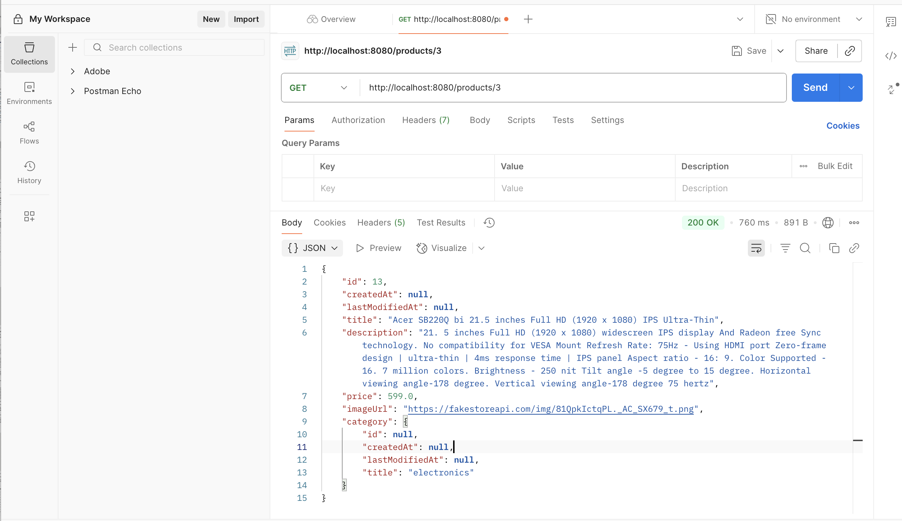

# products-api-springboot

products-api-springboot is a Spring Boot microservice that exposes REST endpoints to retrieve product data by calling a third-party API. It is designed to be resilient, scalable, and easily integrable with other services.

> **Note:** This is an ongoing project. Features such as Resilience (Resilience4j), Caching (Spring Cache + Redis), and advanced Testing (JUnit 5, Spring Boot Test, WireMock) are planned but not yet implemented.

## Table of Contents

- [Features](#features)
- [Tech Stack](#tech-stack)
- [Installation](#installation)
- [Configuration](#configuration)
- [Usage](#usage)
- [Testing](#testing)
- [Contributing](#contributing)
- [License](#license)

## Features

- RESTful API endpoints for product data retrieval
- Integration with a third-party API for product information
- _Planned:_ Resilience with retry and circuit breaker patterns (Resilience4j)
- _Planned:_ Optional caching with Redis
- _Planned:_ Comprehensive testing with JUnit 5, Spring Boot Test, and WireMock

## Tech Stack

- **Language:** Java 17
- **Framework:** Spring Boot 3+
- **HTTP Client:** RestTemplate
- **Resilience (Planned):** Resilience4j (retry, circuit breaker)
- **Caching (Planned/Optional):** Spring Cache + Redis
- **Testing (Planned):** JUnit 5, Spring Boot Test, WireMock

## Installation

### Prerequisites

- Java 17
- Maven 3.8+
- (Optional, for future): Redis server for caching

### Build

```bash
git clone https://github.com/jayamukh/ProductServiceAug25.git
cd ProductServiceAug25
mvn clean install
```

### Run

```bash
# Run with default profile
mvn spring-boot:run

# Or, run the built jar
java -jar target/product-service-aug25-*.jar
```

## Configuration

Configure external API endpoints and (when implemented) Redis and resilience settings in `src/main/resources/application.yml` or via environment variables.

Example snippet (for future use):
```yaml
thirdparty:
  api:
    url: https://api.example.com/products
spring:
  cache:
    type: redis
  redis:
    host: localhost
    port: 6379
resilience4j:
  circuitbreaker:
    instances:
      productApi:
        registerHealthIndicator: true
        slidingWindowSize: 10
        failureRateThreshold: 50
```

## Usage

### Example API Request

```http
GET /api/products/{productId}
```

#### Sample Response

```json
{
  "id": "123",
  "name": "Sample Product",
  "description": "A sample product description.",
  "price": 19.99,
  "imageUrl": "https://example.com/product.png",
  "category": {
    "id": null,
    "title": "electronics"
  }
}
```

## Testing

ProductServiceAug25 can be tested using standard JUnit and integration testing tools, as well as API testing tools such as Postman.

### Testing with Postman

You can verify the API endpoints using Postman. For example, the following image shows a successful GET request to retrieve a product:



> Example:  
> GET `http://localhost:8080/products/3`  
> Returns:
> ```json
> {
>   "id": 13,
>   "createdAt": null,
>   "lastModifiedAt": null,
>   "title": "Acer SB220Q bi 21.5 inches Full HD (1920 x 1080) IPS Ultra-Thin",
>   "description": "...",
>   "price": 599.0,
>   "imageUrl": "https://fakestoreapi.com/img/81QpkIctqPL._AC_SX679_.png",
>   "category": {
>     "id": null,
>     "createdAt": null,
>     "lastModifiedAt": null,
>     "title": "electronics"
>   }
> }
> ```

## Contributing

Contributions are welcome! Please open issues or submit pull requests.

1. Fork the repository
2. Create your feature branch (`git checkout -b feature/YourFeature`)
3. Commit your changes (`git commit -am 'Add new feature'`)
4. Push to the branch (`git push origin feature/YourFeature`)
5. Open a pull request

## License

This project is licensed under the MIT License. See the [LICENSE](LICENSE) file for details.

---

_Maintained by [jayamukh](https://github.com/jayamukh), owner of this repository._
